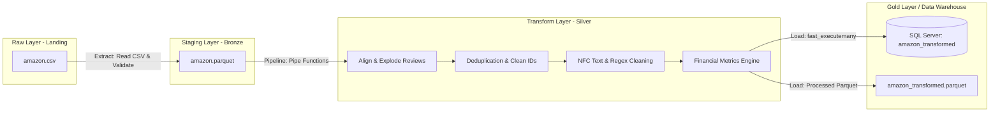
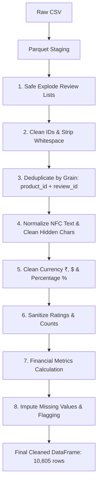

# 🛒 Amazon Sales Data ETL Pipeline & Data Warehouse

Hệ thống **ETL Pipeline (Extract - Transform - Load)** tự động hóa quy trình thu thập, xử lý làm sạch, chuẩn hóa và nạp dữ liệu sản phẩm & đánh giá từ **Amazon Sales Dataset** vào **Microsoft SQL Server (Data Warehouse)** và lưu trữ tối ưu theo định dạng **Apache Parquet**. Dự án hỗ trợ thực thi linh hoạt trên máy cục bộ (Local) hoặc container hóa hoàn chỉnh qua **Docker**.

---

## 📑 Mục lục (Table of Contents)

1. [Project Overview](#1-project-overview)
2. [Architecture / Data Pipeline](#2-architecture--data-pipeline)
3. [Tech Stack](#3-tech-stack)
4. [Project Structure](#4-project-structure)
5. [Data Source](#5-data-source)
6. [Data Processing](#6-data-processing)
7. [Data Quality / Validation](#7-data-quality--validation)
8. [Database / Data Model](#8-database--data-model)
9. [Installation](#9-installation)
10. [Configuration](#10-configuration)
11. [How to Run](#11-how-to-run)
12. [Output](#12-output)
13. [Future Improvements](#13-future-improvements)

---

## 1. Project Overview

Dữ liệu bán hàng và đánh giá sản phẩm trên các nền tảng thương mại điện tử thường có cấu trúc phức tạp: chuỗi văn bản không đồng nhất, định dạng tiền tệ kèm ký hiệu bản địa, các cột chứa danh sách lồng ghép (nested comma-separated strings), và dữ liệu khuyết thiếu. 

Mục tiêu của dự án:
- **Tự động hóa luồng dữ liệu E2E**: Chuyển đổi dữ liệu thô (Raw CSV) sang dữ liệu trung gian có cấu trúc (Staging Parquet), làm sạch sâu và nạp vào Data Warehouse.
- **Giải quyết bài toán 1-to-N Unnesting (Exploding)**: Tách các chuỗi gộp nhiều review (`user_id`, `review_id`, `review_content`,...) thành từng bản ghi riêng lẻ cho từng đánh giá mà không làm lệch thứ tự dữ liệu.
- **Tính toán chỉ số nghiệp vụ (Business Metrics)**: Ước lượng giá vốn, lợi nhuận và biên lợi nhuận cho từng sản phẩm.
- **Đóng gói chuẩn Production**: Kiến trúc hướng đối tượng (OOP), quản lý log đa cấp (Rotating File + Console), và đóng gói Docker chạy độc lập trên mọi hệ điều hành.

---

## 2. Architecture / Data Pipeline

Dự án được xây dựng theo kiến trúc **Medallion Architecture (Bronze - Silver - Gold)**:



### Luồng dữ liệu (Data Flow):
1. **Extract**: Đọc file thô `amazon.csv` (1,465 dòng), kiểm tra tính toàn vẹn và nén lưu trữ thành file columnar `amazon.parquet` tại `data/staging/`.
2. **Transform**:
   - Phân rã chuỗi đánh giá (từ 1,465 dòng sản phẩm nở ra 11,503 dòng review).
   - Khử trùng lặp theo đúng Grain (`product_id` + `review_id`), thu được **10,605 dòng** hợp lệ.
   - Chuẩn hóa text Unicode NFC, làm sạch ký tự vô hình, tiền tệ (`₹`, `$`) và tỷ lệ phần trăm (`%`).
   - Tính toán các cột chỉ số: số tiền giảm giá, giá vốn ước tính, lợi nhuận và biên lợi nhuận.
3. **Load**:
   - Lưu trữ bản sao dữ liệu sạch tại tầng Processed: `data/processed/amazon_transformed.parquet`.
   - Nạp toàn bộ dữ liệu vào bảng `[dw_amazon].[dbo].[amazon_transformed]` trong SQL Server bằng cơ chế batching tốc độ cao.

---

## 3. Tech Stack

| Thành phần | Công nghệ | Chi tiết sử dụng |
| :--- | :--- | :--- |
| **Ngôn ngữ** | Python 3.12+ | Lập trình hướng đối tượng (OOP), xử lý dữ liệu |
| **Xử lý dữ liệu** | Pandas, NumPy | Data manipulation, vectorization, pipe transformations |
| **Định dạng file** | Apache Parquet, PyArrow | Định dạng cột (columnar storage) nén dung lượng cao |
| **Cơ sở dữ liệu** | Microsoft SQL Server 2022 | Lưu trữ Data Warehouse phục vụ báo cáo / BI |
| **Kết nối Database** | SQLAlchemy 2.x, PyODBC 5.x | ORM & DB-API driver với `fast_executemany=True` |
| **Driver hệ thống** | Microsoft ODBC Driver 18 | Giao tiếp mạng với SQL Server (hỗ trợ cả Windows & Linux) |
| **Containerization** | Docker, Docker Desktop | Đóng gói môi trường chạy độc lập |
| **Quản lý cấu hình** | python-dotenv | Quản lý biến môi trường bảo mật qua `.env` |
| **Logging** | Python Logging | Ghi log console & RotatingFileHandler (file xoay vòng 10MB) |

---

## 4. Project Structure

```text
projectMini/
├── data/
│   ├── raw/                           # Dữ liệu nguồn ban đầu
│   │   └── amazon.csv
│   ├── staging/                       # Dữ liệu trung gian sau khi Extract
│   │   └── amazon.parquet
│   └── processed/                     # Dữ liệu sạch sau khi Transform
│       └── amazon_transformed.parquet
├── logs/                              # Nhật ký thực thi luồng ETL
│   └── etl_process.log
├── src/                               # Mã nguồn các module ETL
│   ├── __init__.py
│   ├── config.py                      # Quản lý đường dẫn, kết nối DB & biến môi trường
│   ├── extract.py                     # Module trích xuất (E)
│   ├── transform.py                   # Module làm sạch & biến đổi (T)
│   ├── load.py                        # Module nạp dữ liệu vào SQL Server (L)
│   └── logger.py                      # Cấu hình hệ thống ghi log
├── .dockerignore                      # Danh sách file/thư mục bỏ qua khi build Docker
├── .env                               # File cấu hình biến môi trường cục bộ (không commit)
├── .env.example                       # Mẫu cấu hình môi trường chuẩn
├── .gitignore                         # Danh sách file bỏ qua trên Git
├── Dockerfile                         # Chỉ dẫn đóng gói Docker container Linux
├── main.py                            # Điểm khởi chạy chính (Pipeline điều phối OOP)
├── README.md                          # Tài liệu kỹ thuật chi tiết của dự án
└── requirements.txt                   # Danh sách thư viện Python phụ thuộc
```

---

## 5. Data Source

Dự án sử dụng bộ dữ liệu **Amazon Sales Dataset** từ Kaggle:
- **Kích thước ban đầu**: 1,465 dòng và 16 cột.
- **Các thuộc tính gốc**:
  - `product_id`: Mã định danh sản phẩm Amazon (chuỗi ký tự).
  - `product_name`: Tên sản phẩm.
  - `category`: Danh mục phân cấp cách nhau bởi dấu `|`.
  - `discounted_price`: Giá bán sau chiết khấu (kèm ký hiệu tiền tệ `₹`).
  - `actual_price`: Giá niêm yết ban đầu (kèm ký hiệu tiền tệ `₹`).
  - `discount_percentage`: Phần trăm chiết khấu (dạng chuỗi `%`).
  - `rating`: Điểm đánh giá trung bình của sản phẩm.
  - `rating_count`: Số lượt đánh giá (có dấu phẩy phân tách nghìn).
  - `about_product`: Đoạn văn bản mô tả tính năng sản phẩm.
  - `user_id`, `user_name`: Danh sách mã và tên người dùng đánh giá (ngăn cách bởi `,`).
  - `review_id`, `review_title`, `review_content`: Danh sách ID, tiêu đề và nội dung đánh giá tương ứng (ngăn cách bởi `,`).
  - `img_link`, `product_link`: Đường dẫn ảnh và liên kết sản phẩm.

---

## 6. Data Processing

Quy trình xử lý dữ liệu được thiết kế theo các bước tuần tự và tối ưu hóa hiệu năng:



### Các kỹ thuật nổi bật trong Transform:
1. **Xử lý lệch độ dài chuỗi (Safe Explode)**:
   - Các cột `review_content` và `review_title` chứa dấu phẩy câu tự nhiên tiếng Anh (*"Good cable, fast charge, but..."*). Khi `.split(",")`, số phần tử của `review_content` vọt lên đến 126 phần tử trong khi `review_id` chỉ có 8 phần tử.
   - **Giải pháp**: Thuật toán kiểm tra độ dài đối soát với `review_id`. Nếu phát hiện dòng lệch do dấu phẩy text, thay vì cắt/bù làm xáo trộn ngữ nghĩa của review khác, pipeline ghi log cảnh báo và gán `NULL` cho review content của dòng đó.
2. **Khử trùng lặp chuẩn Grain**:
   - Dữ liệu Amazon ban đầu có nhiều sản phẩm bị lặp lại ở các trang danh mục khác nhau.
   - Sau khi phân rã review, pipeline loại bỏ 898 dòng trùng lặp dựa trên khóa phức hợp `['product_id', 'review_id']`.
3. **Chuẩn hóa Text**:
   - Chuẩn hóa Unicode theo định dạng **NFC** (`unicodedata.normalize`).
   - Xóa bỏ triệt để các ký tự tàng hình (Zero-width spaces `\u200B-\u200D`, BOM `\uFEFF`).
4. **Tính toán chỉ số tài chính (Financial Metrics Engine)**:
   - $DiscountAmount = ActualPrice - DiscountedPrice$
   - $EstimatedCostPrice = ActualPrice \times 0.70$
   - $EstimatedProfit = DiscountedPrice - EstimatedCostPrice$
   - $EstimatedProfitMargin = \left(\frac{EstimatedProfit}{DiscountedPrice}\right) \times 100\%$

---

## 7. Data Quality / Validation

Hệ thống tích hợp các cơ chế kiểm định chất lượng dữ liệu:
- **Kiểm tra File nguồn**: Kiểm tra sự tồn tại của file nguồn và bắt lỗi file rỗng (`EmptyDataError`).
- **Bảo toàn dữ liệu bị thiếu (Missing vs Zero)**: Phân biệt rõ ràng giữa "giá trị 0" và "không có dữ liệu". Không ép `rating` thiếu về 0 (vì đánh giá 0 sao sẽ làm sai lệch mô hình thống kê), mà giữ nguyên `NaN` và thêm cột cờ `is_rating_missing = True`.
- **An toàn ép kiểu số**: Toàn bộ các thao tác parse tiền tệ, phần trăm đều sử dụng `pd.to_numeric(..., errors='coerce')` để chuyển đổi các ký tự lỗi phát sinh thành `NaN` thay vì làm sập pipeline.
- **Hậu kiểm tra nạp DB (Post-load Verification)**: Sau khi nạp vào SQL Server, module Load tự động thực thi truy vấn `SELECT COUNT(*)` để đảm bảo số dòng trong database khớp 100% với số dòng của DataFrame.

---

## 8. Database / Data Model

Dữ liệu được nạp vào cơ sở dữ liệu **`dw_amazon`** tại bảng **`dbo.amazon_transformed`**:

| Tên cột | Kiểu dữ liệu SQL | Ý nghĩa nghiệp vụ |
| :--- | :--- | :--- |
| `product_id` | `NVARCHAR(50)` | Mã sản phẩm định danh trên Amazon |
| `product_name` | `NVARCHAR(MAX)` | Tên sản phẩm đầy đủ |
| `category` | `NVARCHAR(500)` | Phân cấp danh mục sản phẩm |
| `discounted_price` | `FLOAT` | Giá bán thực tế sau khi giảm |
| `actual_price` | `FLOAT` | Giá gốc niêm yết ban đầu |
| `discount_percentage` | `BIGINT` | Tỷ lệ giảm giá (%) |
| `rating` | `FLOAT` | Điểm đánh giá trung bình (1.0 - 5.0) |
| `rating_count` | `BIGINT` | Tổng số lượng đánh giá của sản phẩm |
| `about_product` | `NVARCHAR(MAX)` | Mô tả chi tiết sản phẩm |
| `user_id` | `NVARCHAR(100)` | Mã người dùng viết đánh giá |
| `user_name` | `NVARCHAR(MAX)` | Tên hiển thị của người đánh giá |
| `review_id` | `NVARCHAR(50)` | Mã định danh duy nhất của bài đánh giá |
| `review_title` | `NVARCHAR(MAX)` | Tiêu đề bài đánh giá |
| `review_content` | `NVARCHAR(MAX)` | Nội dung chi tiết bài đánh giá |
| `img_link` | `NVARCHAR(1000)` | Đường dẫn ảnh đại diện sản phẩm |
| `product_link` | `NVARCHAR(1000)` | Đường dẫn trang sản phẩm Amazon |
| `discount_amount` | `FLOAT` | Số tiền được giảm ($Actual - Discounted$) |
| `estimated_cost_price`| `FLOAT` | Giá vốn ước tính ($70\%$ giá niêm yết) |
| `estimated_profit` | `FLOAT` | Lợi nhuận ước tính ($Discounted - Cost$) |
| `estimated_profit_margin` | `FLOAT` | Biên lợi nhuận ước tính (%) |
| `is_rating_missing` | `BIT` | Cờ nhận biết dòng thiếu điểm rating |

> *Toàn bộ cột kiểu chuỗi đều sử dụng `NVARCHAR` để hỗ trợ tuyệt đối Unicode tiếng Việt và các ký tự đặc biệt quốc tế.*

---

## 9. Installation

### Yêu cầu tiên quyết
- **Python**: Phiên bản `3.11` hoặc `3.12`
- **Cơ sở dữ liệu**: Microsoft SQL Server (2019/2022) hoặc SQL Server chạy trên Docker
- **Driver**: Microsoft ODBC Driver 18 for SQL Server đã được cài đặt trên máy
- **Git**

### Các bước cài đặt:

```bash
# 1. Clone repository về máy
git clone https://github.com/your-username/projectMini.git
cd projectMini

# 2. Khởi tạo môi trường ảo Python
python -m venv .venv

# 3. Kích hoạt môi trường ảo
# Trên Windows (Git Bash):
source .venv/Scripts/activate
# Trên Windows (PowerShell):
.venv\Scripts\Activate.ps1
# Trên Linux/macOS:
source .venv/bin/activate

# 4. Cài đặt các thư viện phụ thuộc
pip install --upgrade pip
pip install -r requirements.txt
```

---

## 10. Configuration

1. Sao chép file cấu hình mẫu `.env.example` thành `.env`:
   ```bash
   cp .env.example .env
   ```

2. Cập nhật các thông số kết nối trong file `.env`:
   ```env
   # Mức độ ghi log
   LOG_LEVEL_CONSOLE=INFO
   LOG_LEVEL_FILE=DEBUG

   # Cấu hình SQL Server
   DB_DRIVER=ODBC Driver 18 for SQL Server
   DB_SERVER=localhost
   DB_PORT=1433
   DB_NAME=dw_amazon
   DB_TRUSTED_CONNECTION=no
   DB_TRUST_SERVER_CERTIFICATE=yes
   DB_USER=sa
   DB_PASSWORD=your_password_here
   ```

> [!NOTE]
> - Khi chạy **Local trên máy Windows**: `DB_SERVER=localhost`.
> - Khi chạy **qua Docker Container**: `DB_SERVER=host.docker.internal` (để container gọi ra máy host) và bắt buộc đặt `DB_TRUSTED_CONNECTION=no` cùng user `sa` / password.

---

## 11. How to Run

### Cách 1: Chạy trực tiếp toàn bộ Pipeline trên máy Host (Khuyên dùng)
```bash
python main.py
```

### Cách 2: Chạy kiểm thử từng module độc lập
```bash
# Bước 1: Trích xuất raw -> staging
python src/extract.py

# Bước 2: Làm sạch & biến đổi staging
python src/transform.py

# Bước 3: Nạp vào SQL Server & processed
python src/load.py
```

### Cách 3: Chạy đóng gói qua Docker Container

```bash
# 1. Build Docker image
docker build -t amazon-etl:latest .

# 2. Chạy container kết nối tới SQL Server ngoài máy thật
docker run --rm --env-file .env -e DB_SERVER=host.docker.internal amazon-etl:latest

# 3. (Tùy chọn) Chạy container kèm mount volume để đồng bộ file Parquet & Log ra máy thật
docker run --rm \
  --env-file .env \
  -e DB_SERVER=host.docker.internal \
  -v "$(pwd)/data:/app/data" \
  -v "$(pwd)/logs:/app/logs" \
  amazon-etl:latest
```

---

## 12. Output

### 1. Báo cáo Console khi hoàn tất:
```text
######################################################################
            KHỞI CHẠY PIPELINE ETL DỮ LIỆU AMAZON                     
######################################################################

======================================================================
 >>> [BƯỚC 1/3] EXTRACT: Trích xuất 'amazon.csv' -> Staging Parquet
======================================================================
INFO     Trích xuất và nạp vào staging hoàn tất: amazon.parquet (Kích thước: 2.25 MB, 1,465 dòng)

======================================================================
 >>> [BƯỚC 2/3] TRANSFORM: Tách chuỗi review, làm sạch & tính tài chính
======================================================================
INFO     Transform hoàn tất: 10,605 dòng, 21 cột.

======================================================================
 >>> [BƯỚC 3/3] LOAD: Nạp dữ liệu vào SQL Server [dw_amazon].[amazon_transformed]
======================================================================
INFO     Lưu file processed hoàn tất: amazon_transformed.parquet (10,605 dòng, 1.45 MB)
INFO     Nạp dữ liệu vào SQL Server thành công! Bảng [amazon_transformed] hiện có 10,605 dòng.

======================================================================
               BÁO CÁO TỔNG KẾT QUY TRÌNH ETL (SUMMARY)               
======================================================================
 * Trạng thái thực thi   : THÀNH CÔNG (SUCCESS)
 * Tổng thời gian chạy   : 1.50 giây
 * Dữ liệu đầu vào (Raw) : 1,465 dòng
 * Dữ liệu sau biến đổi  : 10,605 dòng (đã phân rã review)
 * Dữ liệu nạp vào DB    : 10,605 dòng
 * Database đích         : dw_amazon (SQL Server)
 * Bảng dữ liệu đích     : amazon_transformed
 * File Parquet lưu trữ  : data/processed/amazon_transformed.parquet
======================================================================
```

### 2. Các tài nguyên được sinh ra:
- **`data/staging/amazon.parquet`**: Lưu trữ dạng nén columnar của file raw (2.25 MB).
- **`data/processed/amazon_transformed.parquet`**: Dữ liệu sạch đã chuẩn hóa và tính toán (1.45 MB).
- **`logs/etl_process.log`**: File log chi tiết quá trình chạy, hỗ trợ audit và debug.
- **SQL Server Table**: Bảng `[dw_amazon].[dbo].[amazon_transformed]` chứa 10,605 dòng dữ liệu sẵn sàng cho BI/Analytics.

---

## 13. Future Improvements

Các định hướng nâng cấp trong các giai đoạn tiếp theo:
1. **Thiết kế Star Schema (Kimball Methodology)**:
   - Tách bảng dẹt hiện tại thành mô hình đa chiều gồm các bảng Dimension (`dim_products`, `dim_users`, `dim_categories`) và Fact (`fact_reviews`, `fact_sales`).
2. **Orchestration & Lập lịch**:
   - Tích hợp **Apache Airflow** hoặc **Prefect** để quản lý DAGs, lập lịch chạy tự động hàng ngày (daily batch) kèm cơ chế retry khi lỗi mạng.
3. **Kiểm thử chất lượng tự động (Data Contracts & Testing)**:
   - Tích hợp công cụ **Great Expectations** hoặc **dbt (data build tool)** để kiểm tra các ràng buộc: không trùng khóa chính, giá trị rating hợp lệ (1-5), giá tiền không âm trước khi nạp vào Data Warehouse.
4. **Mở rộng Cloud Data Warehouse**:
   - Thêm target loader hỗ trợ nạp dữ liệu lên đám mây: Google BigQuery, Snowflake hoặc AWS Redshift.
5. **Dashboard Trực quan hóa**:
   - Xây dựng dashboard báo cáo tương tác trên **Power BI** hoặc **Tableau** kết nối trực tiếp bảng `amazon_transformed` để phân tích mối tương quan giữa tỷ lệ giảm giá và điểm rating của sản phẩm.
